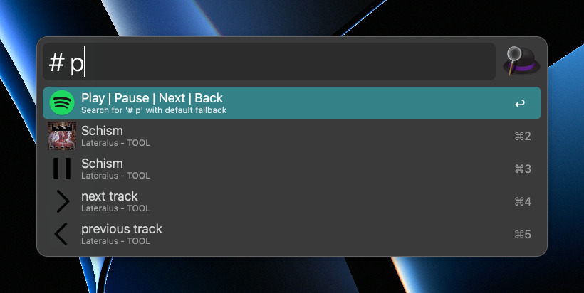

#  Alfred-Workflow "Mini Spotify"

This workflow for [Alfred.app](https://alfred.app) allows to quickly interact with
[Spotify](https://spotify.com).

## Usage

* s|stop - Stop
* p|play|pause - Toggle between Play and Pause
* n|nt|next - Play next track
* pr|prev - Previous track
* anything else - Open the Spotify App

## References

* https://developer.spotify.com

* /Applications/Spotify.app/Contents/Resources/Spotify.sdef

* https://github.com/dronir/SpotifyControl/issues/2

## License

See LICENSE file.
